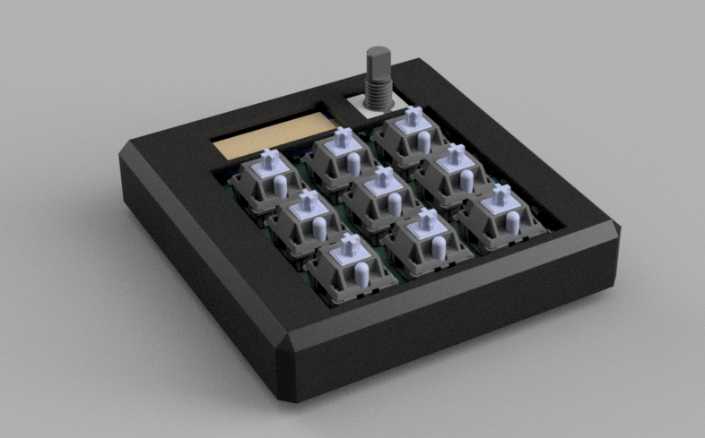
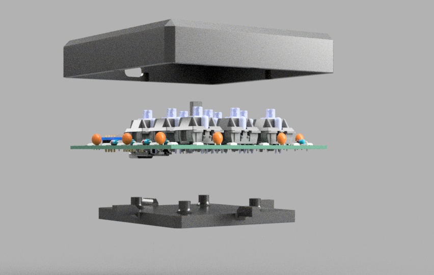
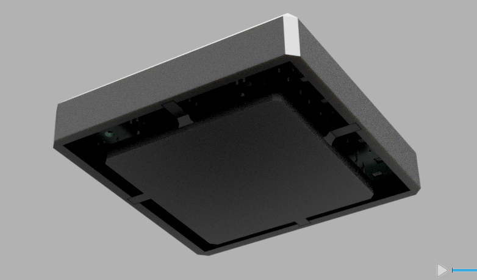
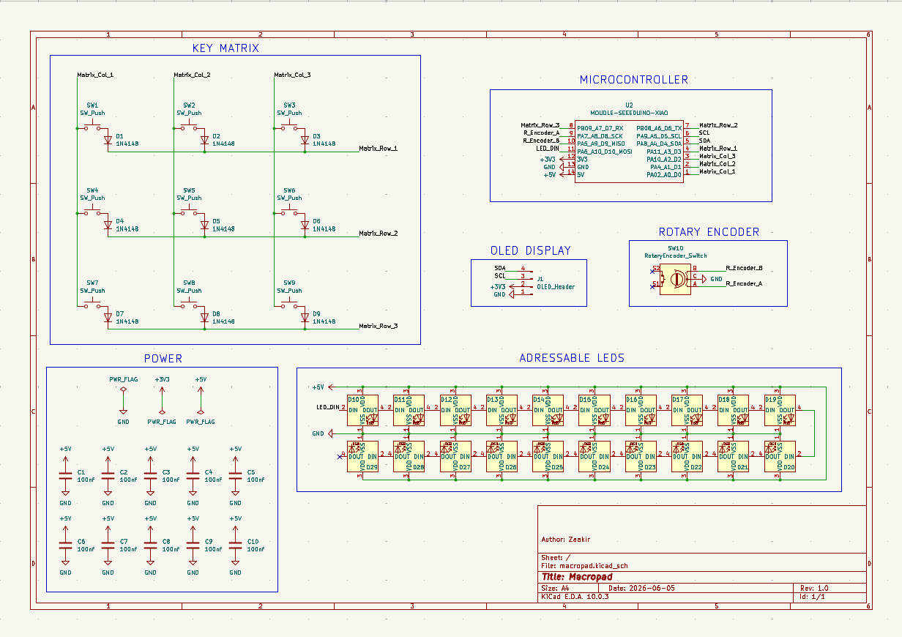
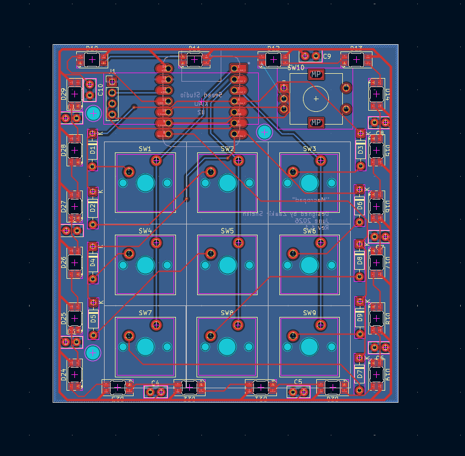

# Macropad

This macropad has 9 keys, an OLED display, a rotary encoder, and 20 individually adressable LEDs for an underglow effect.

## Features
* Two piece PLA case (no screws or heatset inserts necessary!)
* 128x32 OLED display
* EC11 rotary encoder
* 9 keys arranged in a 3x3 matrix
* 20 SK6812MINI-E indvidually adressable LEDs for underglow effects
* Supports QMK, KMK, and more

## Cad Model
The PCB gets sandwiched in between the main body and the bottom piece. The PCB can be glued using the 4 corners onto the main body or foam or some kind of riser can be placed on the protruding columns on the bottom plate. When the bottom plate is glued to the main body the column will snugly fix the PCB in place. This allows the case to stay slim and compact while still allowing the underglow effect to take place.

Made in Fusion 360.

## Schematic + PCB
The PCB was made in KiCad, it incorporates 2 layers, a ground plane, and vias.

## Firmware
Currently the firmware is designed to use KMK and circuitpython. However in the future I would like to upgrade to QMK due to its gui configuration interface and more advanced features.

## BOM
Everyting you need to make this macropad:

| Part | Quantity | Optional |
| --- | --- | --- |
| Cherry MX switches | 9 |
| DSA keycaps | 9 |
| 1N4148 DO-35 diode | 9 |
| SK6812MINI-E LED | 20 |
| 0.91" 128x32 i2c OLED Display | 1 |
| EC11 Rotary Encoder | 1 |
| XIAO RP2040 microcontroller | 1 |
| PCB | 1 |
| Case - top | 1 |
| Case - bottom | 1 |
| 100nf through-hole capacitor | 10 | yes

Right now the capacitors were added into the PCB just in case there are any issues with voltage drops due to the amount of LEDs.
